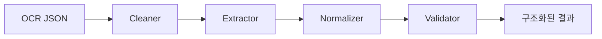

# 🏗️ 간단한 설계 문서: OCR 계량증명서 파서

이 문서는 복잡한 `DESIGN_EXPLANATION_KR.md`의 요약본으로, 시스템의 핵심 구조와 원리를 빠르고 쉽게 이해할 수 있도록 작성되었습니다.

## 1. 🎯 목표
OCR(광학 문자 인식)로 변환된 계량증명서 데이터(JSON)에서 **차량번호, 계량일시, 중량(총/공/실)** 정보를 정확하게 추출하고 검증하여 구조화된 데이터로 변환합니다.

## 2. 🧩 시스템 구조 (파이프라인)
이 시스템은 **"파이프라인 아키텍처"**를 따릅니다. 데이터는 한 방향으로 흐르며 각 단계는 독립적인 역할을 수행합니다.

### 각 모듈의 역할
1.  **🧹 Cleaner (청소부)**
    *   **역할**: OCR 결과에서 노이즈(특수문자, 불필요한 공백)를 제거하고 텍스트를 깨끗하게 만듭니다.
    *   **핵심**: 유니코드 정규화(NFKC)로 한글 자모 깨짐 현상을 해결합니다.

2.  **🔍 Extractor (탐정)**
    *   **역할**: 정규표현식(Regex)을 사용하여 핵심 데이터(무게, 날짜, 차량번호)를 찾아냅니다.
    *   **전략**: 여러 가지 패턴을 준비해두고 순서대로 매칭을 시도하여, 영수증 형식이 조금 달라도 유연하게 대응합니다.

3.  **⚖️ Normalizer (번역가)**
    *   **역할**: 추출된 문자열을 컴퓨터가 이해하기 쉬운 표준 형식으로 변환합니다.
        *   **숫자**: "12,480 kg" → `12480` (Decimal)
        *   **날짜**: "2026년 2월 2일" → `2026-02-02` (ISO 8601)
    *   **특징**: 정확한 계산을 위해 `float` 대신 `Decimal` 타입을 사용합니다.

4.  **✅ Validator (검사관)**
    *   **역할**: 데이터가 논리적으로 맞는지 검증합니다.
    *   **검증 규칙**:
        *   **수식 검증**: `총중량 - 공차중량 = 실중량` (오차 1kg 이내 허용)
        *   **필수값 확인**: 차량번호나 무게가 누락되지 않았는지 확인합니다.

## 3. 📂 데이터 흐름 예시

1.  **입력**: `{"text": "총 중 량 : 12, 480kg ..."}`
2.  **Cleaner**: `"총중량: 12,480kg ..."` (공백 정리)
3.  **Extractor**: `{'gross': '12,480', ...}` (숫자만 추출)
4.  **Normalizer**: `{'gross_kg': Decimal('12480'), ...}` (타입 변환)
5.  **Validator**: `12480 - 7470 = 5010` (수식 검증 OK)
6.  **출력**: `{"is_valid": true, "data": {...}}`

## 4. 🛠️ 기술 스택
*   **언어**: Python 3.10+
*   **검증**: Pydantic (데이터 스키마 정의 및 타입 체크)
*   **테스트**: Pytest (단위 테스트)

---
더 자세한 내용은 [DESIGN_EXPLANATION_KR.md](DESIGN_EXPLANATION_KR.md)를 참고하세요.
